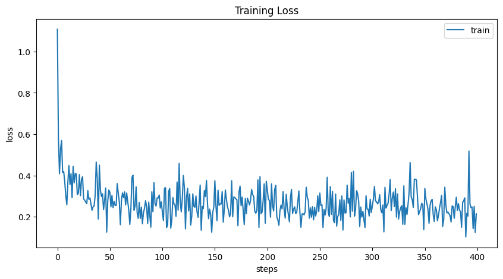
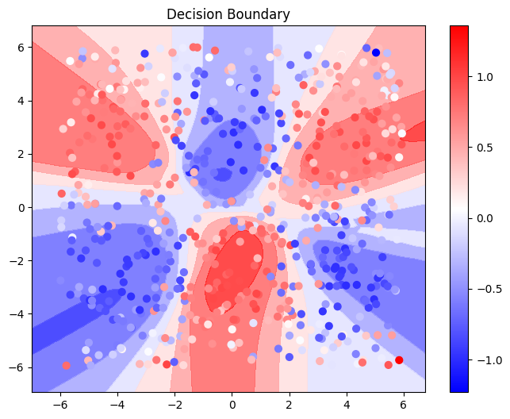

# micrograd

> This repo record my implementaion of https://www.youtube.com/watch?v=VMj-3S1tku0 by Karpathy. And I think this is a good way to understand how PyTorch works under the hood.

> Original Repo: A tiny Autograd engine (with a bite! :)). Implements backpropagation (reverse-mode autodiff) over a dynamically built DAG and a small neural networks library on top of it with a PyTorch-like API. Both are tiny, with about 100 and 50 lines of code respectively. The DAG only operates over scalar values, so e.g. we chop up each neuron into all of its individual tiny adds and multiplies. However, this is enough to build up entire deep neural nets doing binary classification, as the demo notebook shows. Potentially useful for educational purposes.

What I have done:

- [x] Implement the `optim` module
- [x] Modify the `nn` module make it more like PyTorch(Add `CrossEntropyLoss`, `MSELoss` etc)
- [x] A `dataset.py` to load cool regression and classification datasets
- [x] A `demo.ipynb` to demonstrate how to use the `micrograd` to train the model on the datasets

| Training Loss | Decision Boundary on Regression Task|
| ------------- | ----------------------------------- |
|  |  |


## Requirements

```bash
pip install -r requirements.txt
```

- graphviz
  - https://www.graphviz.org/download/

## Reference

- https://github.com/karpathy/micrograd
- https://github.com/karpathy/nn-zero-to-hero/tree/master?tab=readme-ov-file
